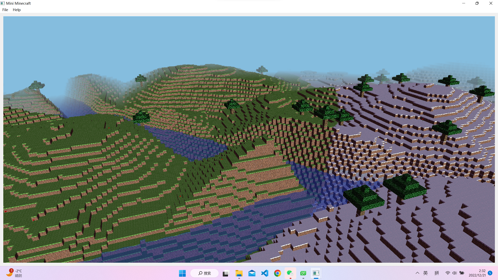
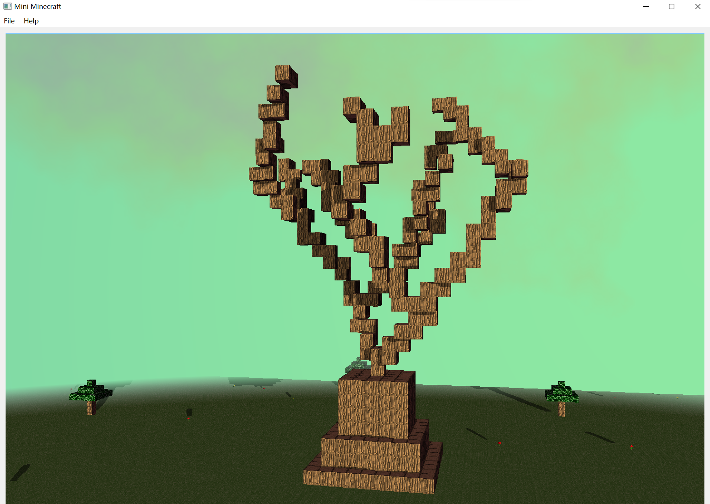

# Mini-Minecraft

It's a mini version of Minecraft using C++, OpenGL and Qt.

Since it's a group project from my master course, here I only list out features that totally independently accomplished by me.

Video link: https://drive.google.com/file/d/14Ui341_NEk85WpPFdwvwCrQz8KxttzNy/view?usp=share_link

**Features**

	- Procedural generation of terrain using noise functions.
	- Multithreading of terrain loading
	- Additional Biomes
	- L-system River
	- Procedurally Placed Assets
	- Procedural buildings with shape grammars

**Implementation Details**

Procedural Terrain:

	I use a perlin noise function to decide mountain noise value, and perturbed fbm & worley noise to decide grassland noise value. For the detail of grassland value, I lerp between fbm and worley noise.
	Then, I use another smoothsteped perlin noise to generate a biome noise value, and interpolate between the biomes. If this noise value is bigger than 0.5, then this place is mountain biome, otherwise it's grassland biomme.
	Also, the final height comes from lerpping in mountain noise value and grassland noise value, where u is the biome noise value.

	Difficult 1: The performance of noise function is different between hlsl version used in openGLFun and my C++ version used now.
	Solution: One reason is the input changed from [0, 1] to about several hundered. So I need to test for different configs for better performance.
		   And with minus input value, the execution of some std function is different from what I expect.

Multithreaded Terrain Generation:

	Initially, I try to use std::thread, but finally, considering the performance, I switch from std::thread into QThread, though both version could work out.

	And basically, I followed the instruction in project requirement. So I divide all the work into two workers: BlockTypeWorker and VBOWorker. In BlockTypeWorker, given the x and z position of chunks in the zone, it will decide what blocks should have in the zone, according to the set of previous noise functions in milestone-1.

	Then after the chunks are created, they will be passed into VBOWorker, where their VBO information would be generated. Then finally, after the child thread ends for this chunk, the chunk's information about renderring would be sent to GPU on main thread.

Additional Biomes:

	Using perlin noise functions with different configurations, 2 properties, moisture and temperature, are generated. Then according to these two properties, four different biomes: grassland, mountain, snowland, desert are generated. To make them different, moutain area is steeper than other biomes.

L-system River:

	In the river implementation, we calculate river using L-system, so it's calculated iteratively. In my algorithm, there is a vector to store pairs of beginning position and direction of the new river part. Then in each iteration, every pair will be expand to a part of the whole river with fork, also new pairs of beginning positions and direction will also be generated at the same time.

	To accomodate multithread, in the beginning, the algorithm will frist generate some river to cover the beginning area. Then when player move further and enter a new area, river in this area would be generated acoordingly. To implement such kind of feature, a unordered_map is used to store the beginning pair of river parts, acoording to position of the chunk it belongs to.

	And the generated rivers information are stored as lines, with begin position and end position. Then in terrain generation algorithm, after biomes are generated at a given horizontal position, we will check how far is it to the nearest river line. If it's near enough, the ground will carve acoording to its distance to the river line, and water would be filled.

Procedurally Placed Assets:

	In each chunk, we will randomly pick up a point to generate the placed assets. There are two kinds of assets, one is small asset like flower and mushroom. The other one is bigger asset like a tree.

	Small asset only take one block, so in fact, each small asset is a block. To make it look like flower, we cancel its top and bottom face, and set other 4 faces to the center of block, to make it look like a 3D object. And we discard the fragment with 0 alpha value in texture to avoid wired bugs of bloking other blocks in the wrong way.

	The tree would take 5x5 area. To avoid unnecesssary effort, faster speed, and accomodate multithread, I decide to let the tree generate only within a chunk.

Procedural buildings with shape grammars:

	I also build a large tree-like-building on the map, which is generated using L-system. Basically, this process is similar to the L-system river. So I won't duplicate those words one more time. The main difference between this and river is that, the direction of lines need to be 3D but not only in XZ directions.

